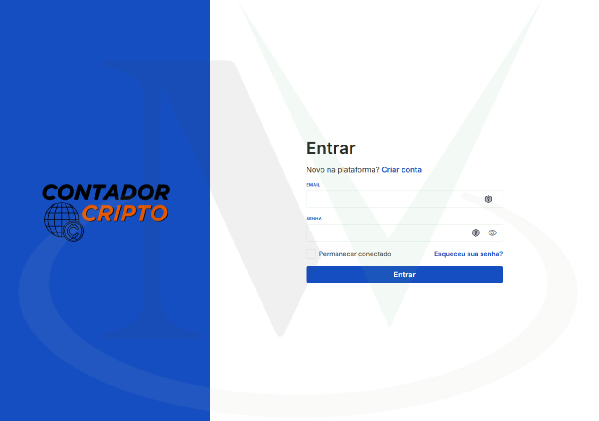
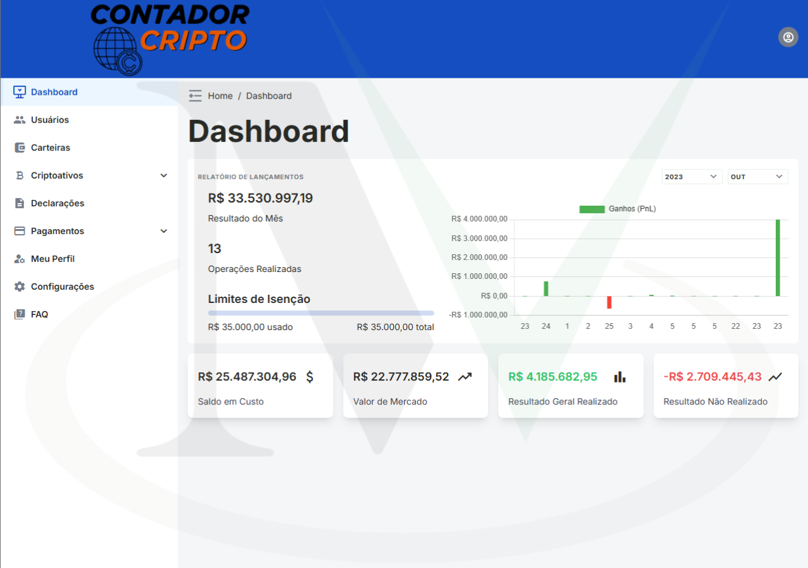
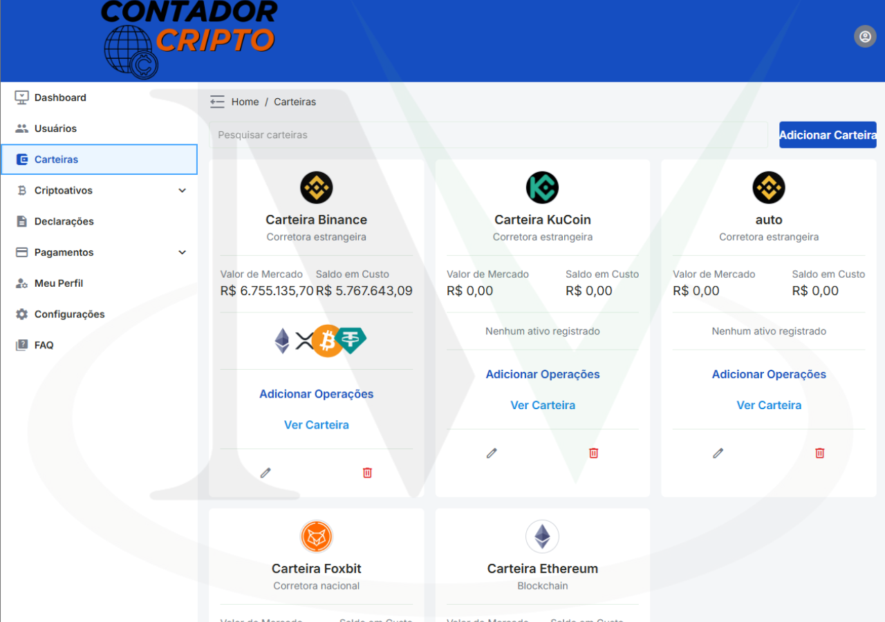
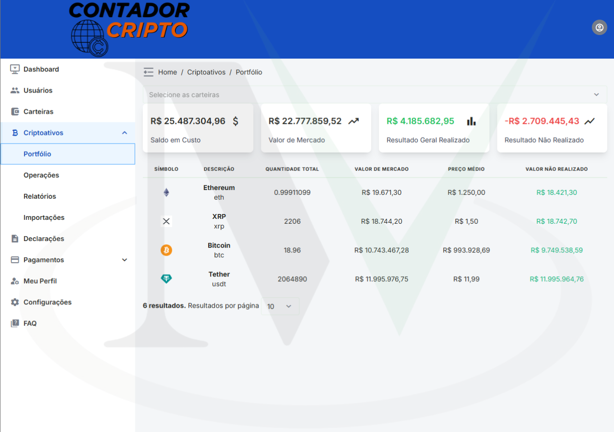
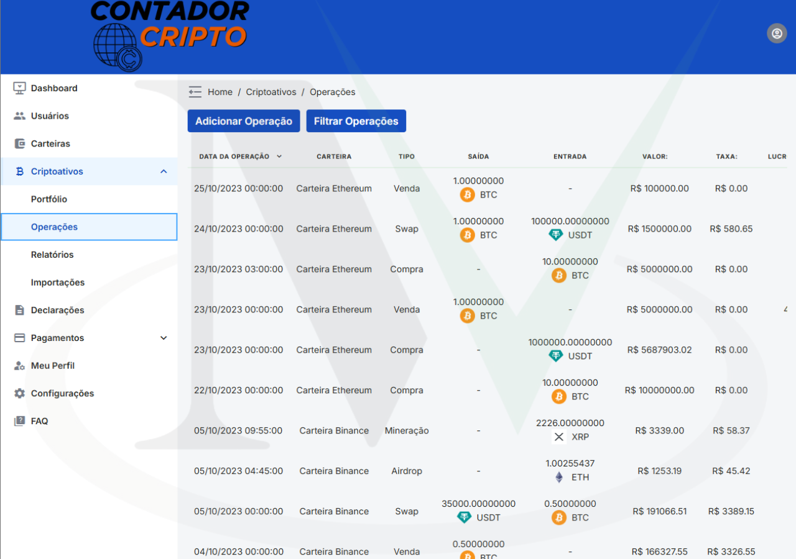
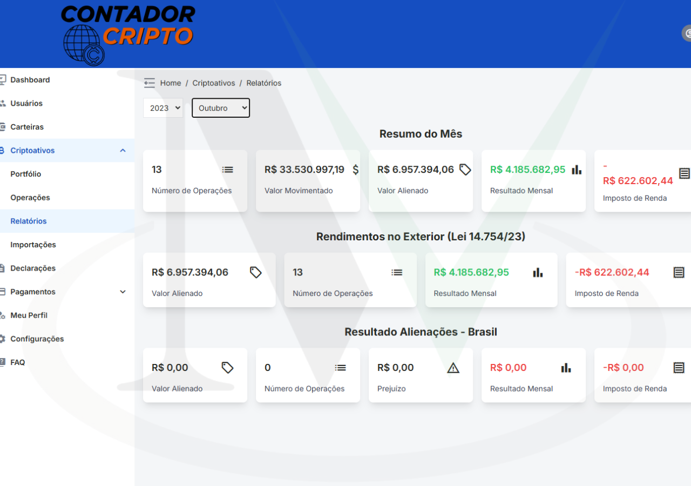
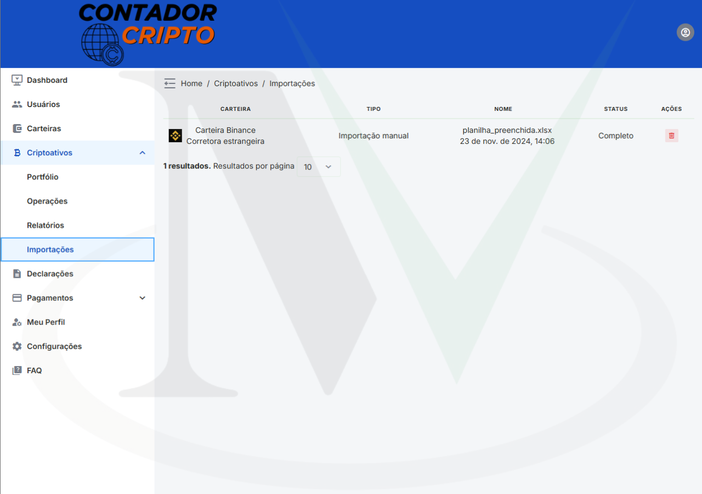
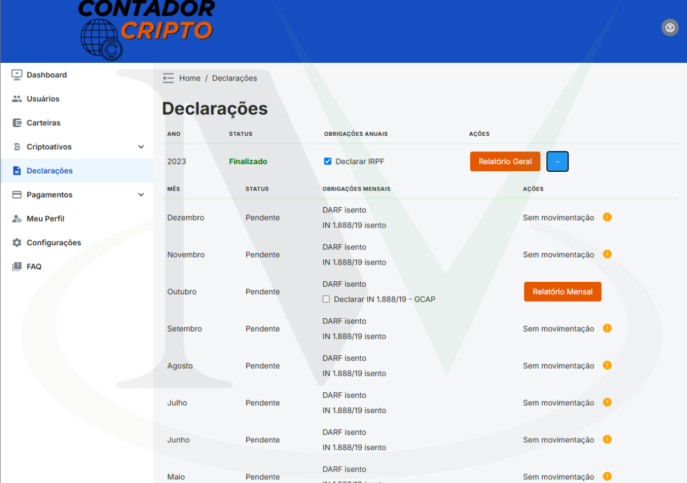

# Meu Contador Cripto 🚀

**Meu Contador Cripto** é uma aplicação inovadora para gerenciamento e análise de operações com criptomoedas, oferecendo funcionalidades avançadas para facilitar a vida dos investidores.

---

## Funcionalidades ✨

- **Importação de Dados** 📥: Suporte para importação de operações via planilhas e API.
- **Geração de Relatórios** 📊: Criação de relatórios anuais e de câmbio estrangeiro.
- **Integração com Exchanges** 🔗: Conexão com diversas exchanges para sincronização de dados.
- **Monitoramento em Tempo Real** ⏱️: Logs e monitoramento de operações e serviços.

---

## Tecnologias Utilizadas 🛠️

### Backend
- **Python** 🐍: Linguagem principal para desenvolvimento do backend.
- **Django** 🌐: Framework web para construção de APIs e gerenciamento de dados.
- **Celery** 🥬: Para tarefas assíncronas e agendamento de jobs.
- **PostgreSQL** 🗄️: Banco de dados relacional para armazenamento de dados.
- **Redis** 🔴: Utilizado como broker para o Celery.
- **OpenPyXL** 📑: Manipulação de arquivos Excel para geração de relatórios.
- **Nginx** 🌐: Servidor web para servir a aplicação e arquivos estáticos.
- **Gunicorn** 🦄: Servidor WSGI para aplicações Python.

### Frontend
- **Vue.js** 🖼️: Framework JavaScript progressivo para construção de interfaces de usuário interativas.
- **Vuex** 📦: Gerenciamento de estado centralizado para aplicações Vue.js.
- **Vue Router** 🧭: Roteamento para navegação entre páginas em aplicações Vue.js.

### DevOps
- **Ubuntu** 🐧: Sistema operacional utilizado para o ambiente de produção.
- **Docker** 🐳: Containerização para garantir consistência entre ambientes de desenvolvimento e produção.
- **Google Cloud Platform (GCP)** ☁️: Plataforma de nuvem utilizada para hospedar a aplicação.
- **GitHub Actions** ⚙️: Integração contínua e entrega contínua (CI/CD) para automação de testes e deploys.

---

## Autores 👥

- **@miltonvo** 👨‍💻: Principal desenvolvedor e responsável pela manutenção do projeto.

---

## Demonstração 🎥

|  |  |  |
|:-------------------------:|:-------------------------:|:-------------------------:|
|  |  |  |
|  |  |  |

