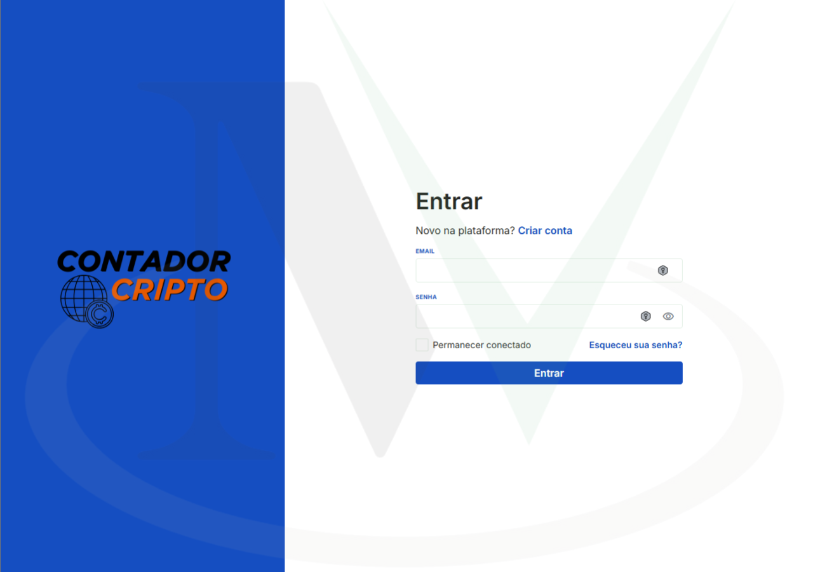
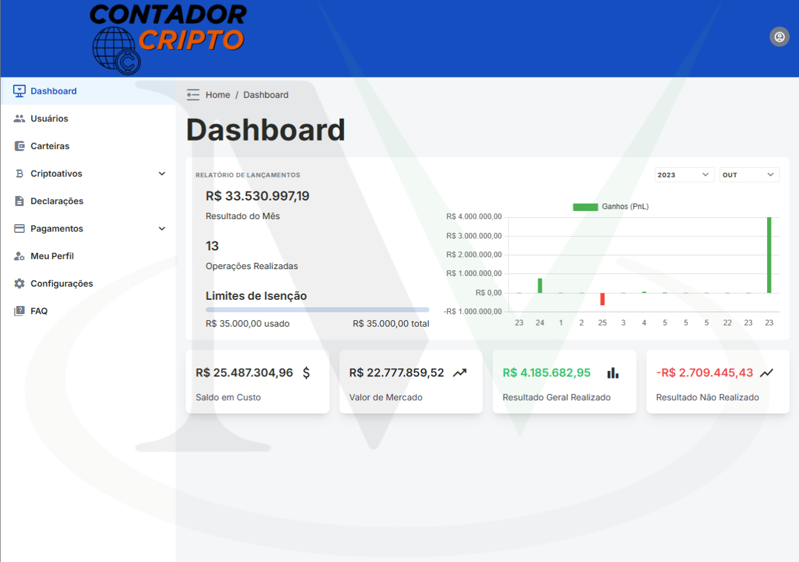
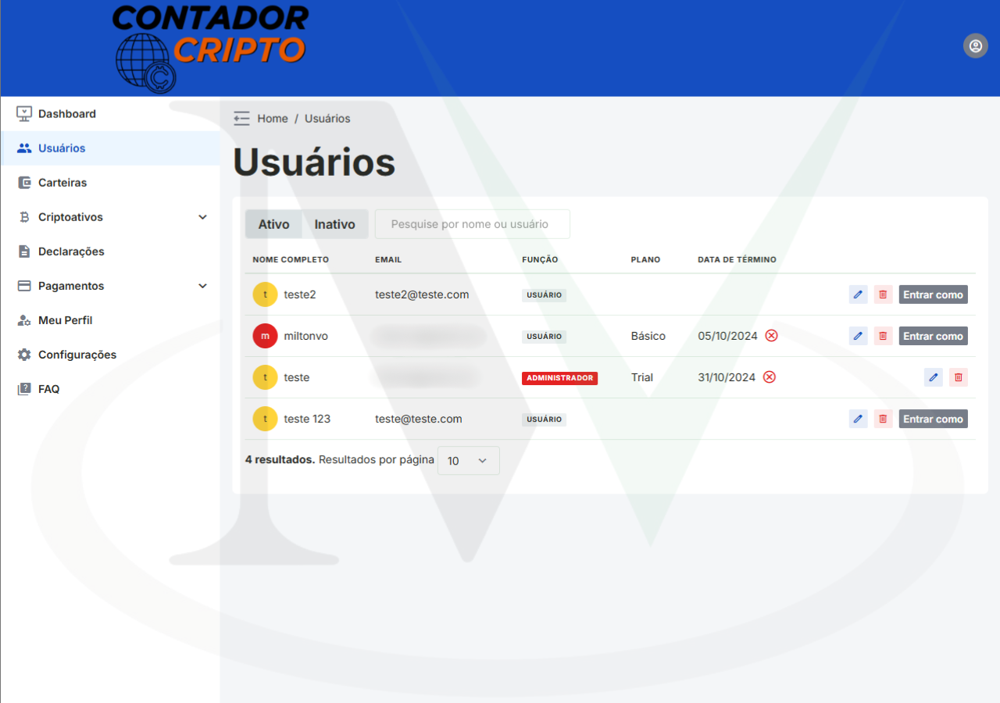
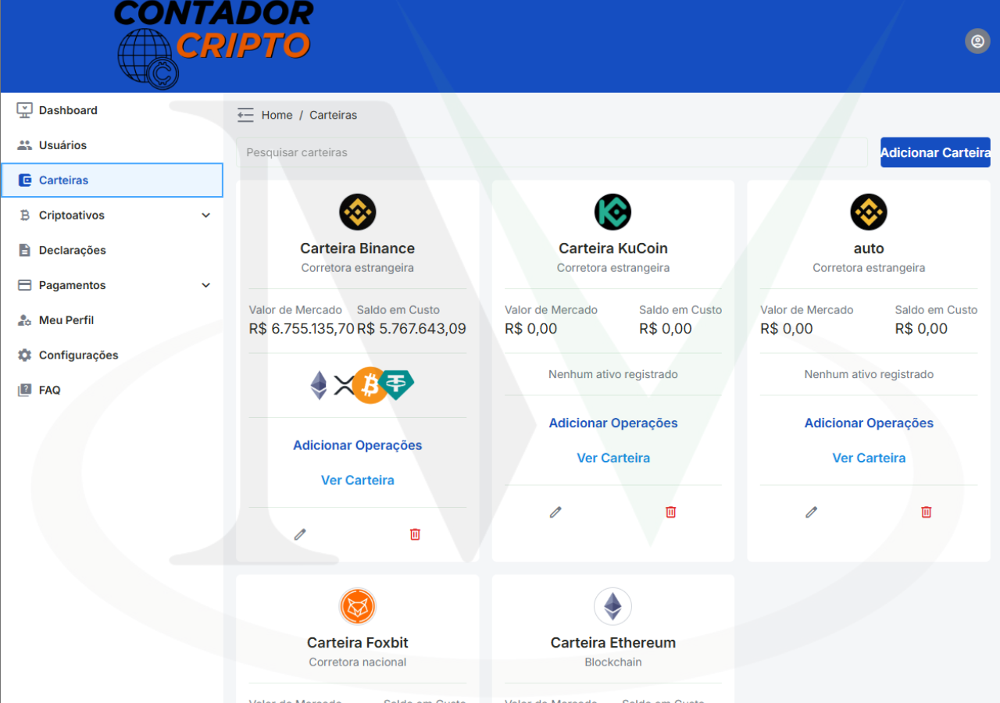
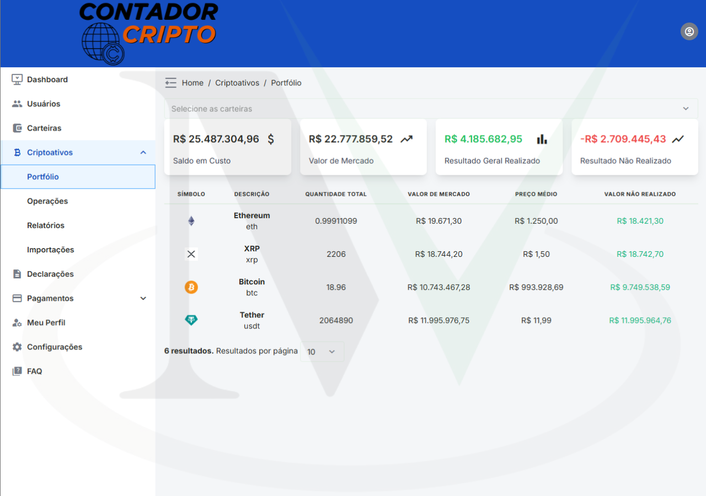
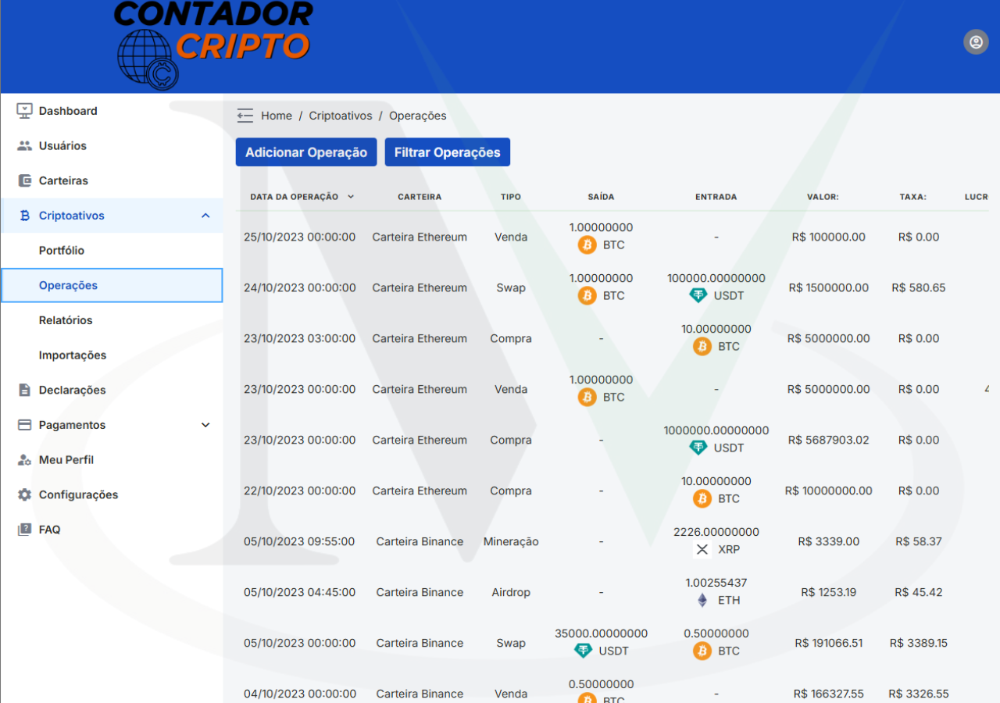
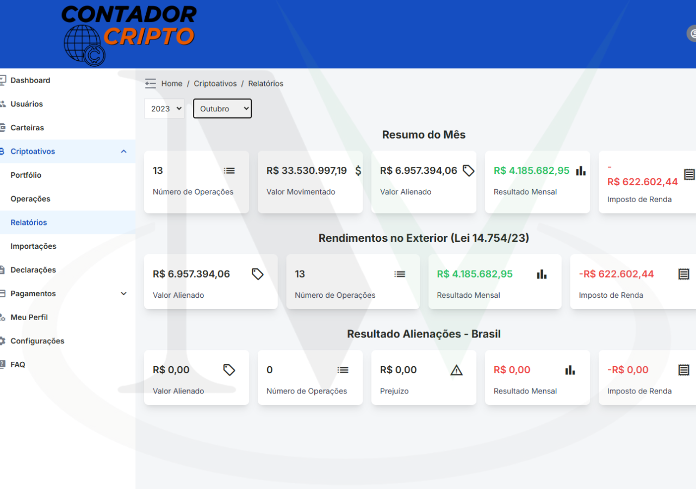
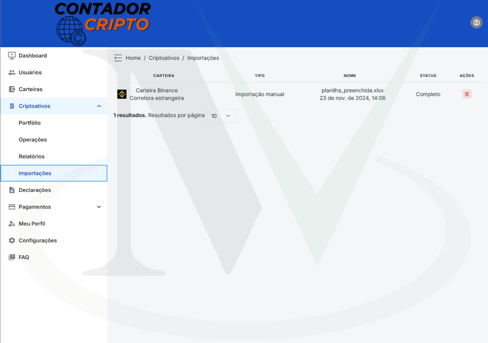
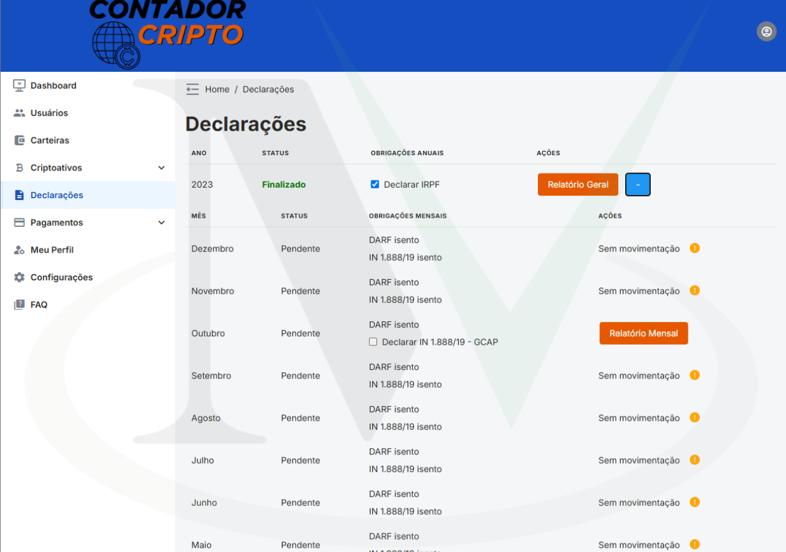
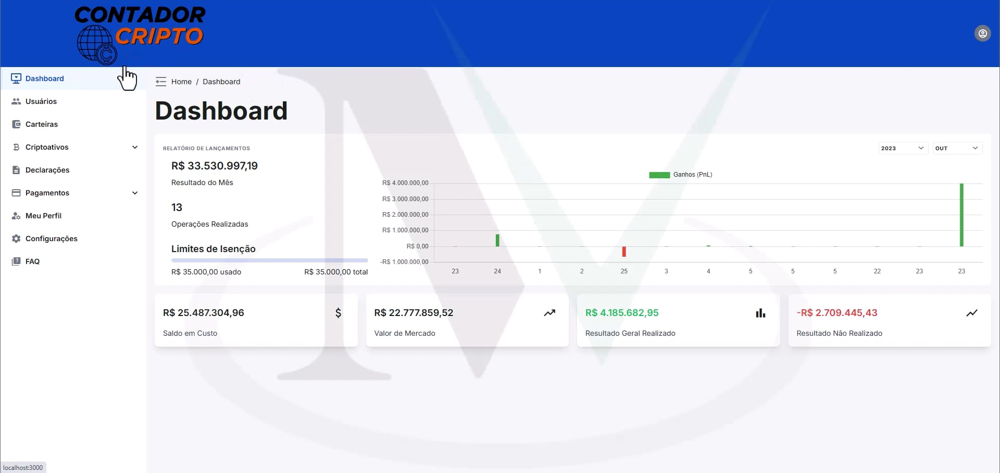

  <!-- Idiomas: -->
  <a title="Português" href="README_ptbr.md">🇧🇷 Português</a>

# My Crypto Counter 🚀

**My Crypto Counter** is an innovative application for managing and analyzing cryptocurrency operations, offering advanced features to facilitate investors' lives.

---

## Features ✨

- **Data Import** 📥: Support for importing operations via spreadsheets and API.
- **Report Generation** 📊: Creation of annual and foreign exchange reports.
- **Exchange Integration** 🔗: Connection with various exchanges for data synchronization.
- **Real-Time Monitoring** ⏱️: Logs and monitoring of operations and services.

---

## Technologies Used 🛠️

### Backend
- **Python** 🐍: Main language for backend development.
- **Django** 🌐: Web framework for building APIs and data management.
- **Celery** 🥬: For asynchronous tasks and job scheduling.
- **PostgreSQL** 🗄️: Relational database for data storage.
- **Redis** 🔴: Used as a broker for Celery.
- **OpenPyXL** 📑: Excel file manipulation for report generation.
- **Nginx** 🌐: Web server to serve the application and static files.
- **Gunicorn** 🦄: WSGI server for Python applications.

### Frontend
- **Vue.js** 🖼️: Progressive JavaScript framework for building interactive user interfaces.
- **Vuestic UI + Pinia** 📦: admin UI components and state management for Vue 3.
- **Vue Router** 🧭: Routing for navigation between pages in Vue.js applications.

### DevOps
- **Ubuntu** 🐧: Operating system used for the production environment.
- **Docker** 🐳: Containerization to ensure consistency between development and production environments.
- **Google Cloud Platform (GCP)** ☁️: Cloud platform used to host the application.
- **GitHub Actions** ⚙️: Continuous integration and continuous delivery (CI/CD) for automating tests and deployments.

---

## Authors 👥

- **@miltonvo** 👨‍💻: Main developer and responsible for project maintenance.

---

## Demonstration 📺

|  |  |  |
| *Dashboard* | *Portfolio Overview* | *Operations List* |
|  |  |  |
| *Report Generation* | *Exchange Integration* | *Data Import* |
|  |  |  |
| *Tax Reports* | *Settings* | *Monitoring Panel* |

### Video Demonstration 🎥

🔗 **Clickable content below** ⬇️

---

📄 Full case study on the MV Dev Solutions website: [https://mvdevsolutions.com.br/en/projects/my-crypto-counter-cryptocurrency-portfolio-management](https://mvdevsolutions.com.br/en/projects/my-crypto-counter-cryptocurrency-portfolio-management)
